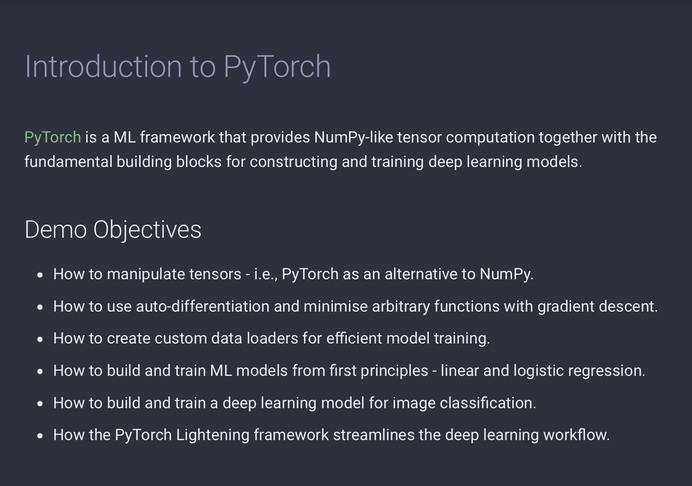
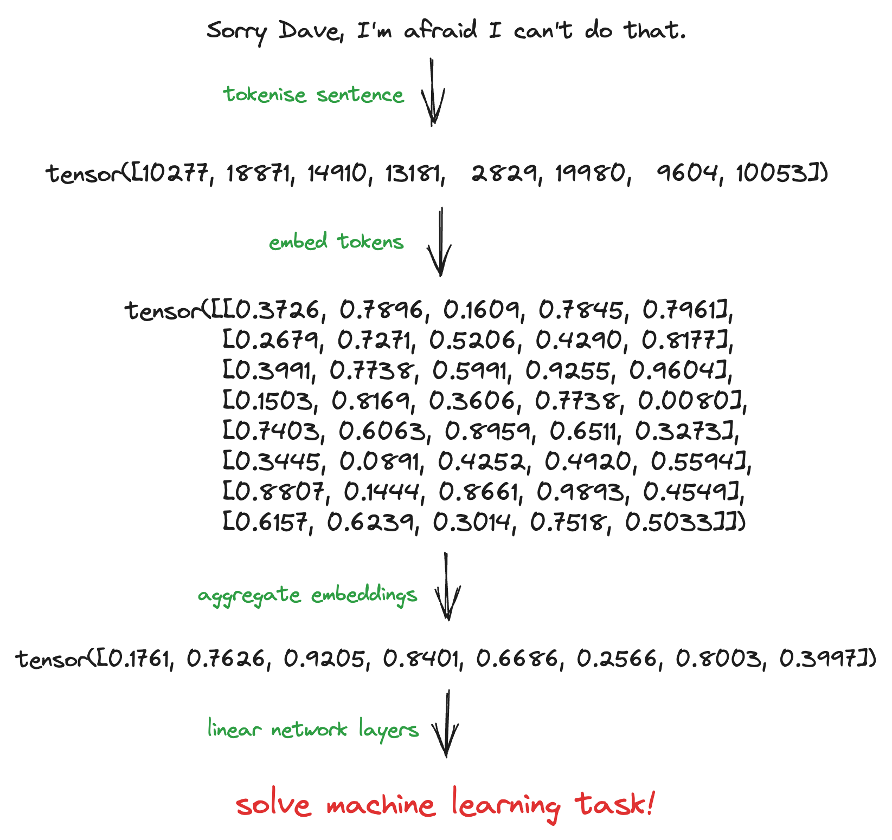
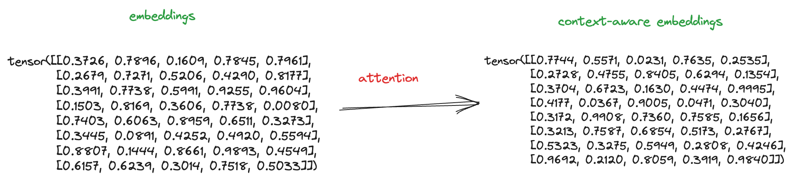
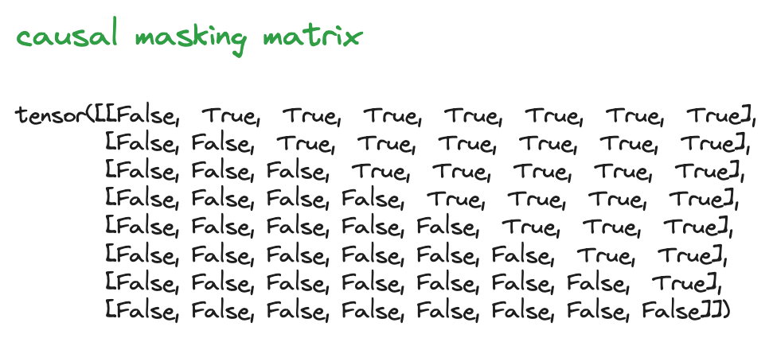
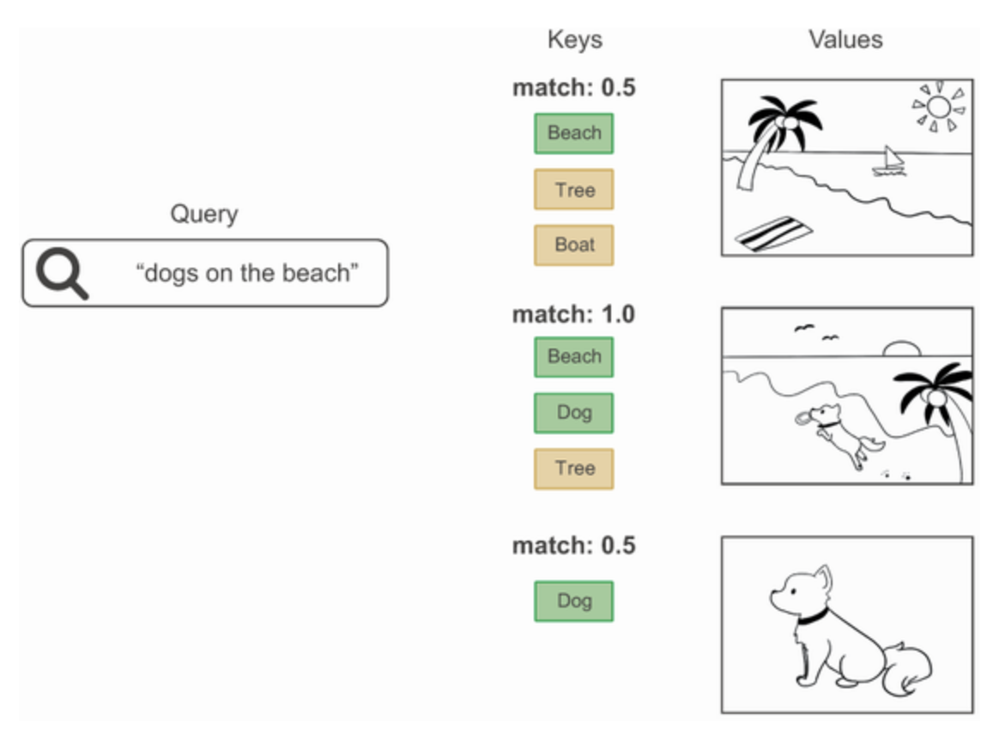
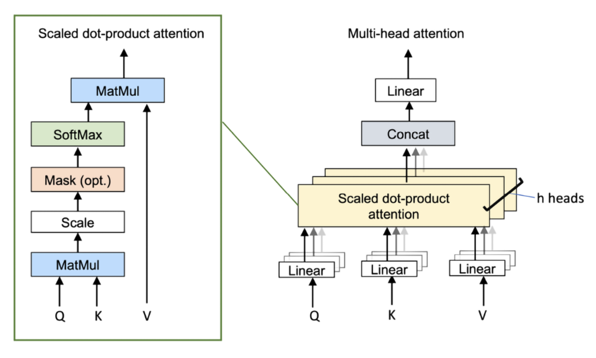
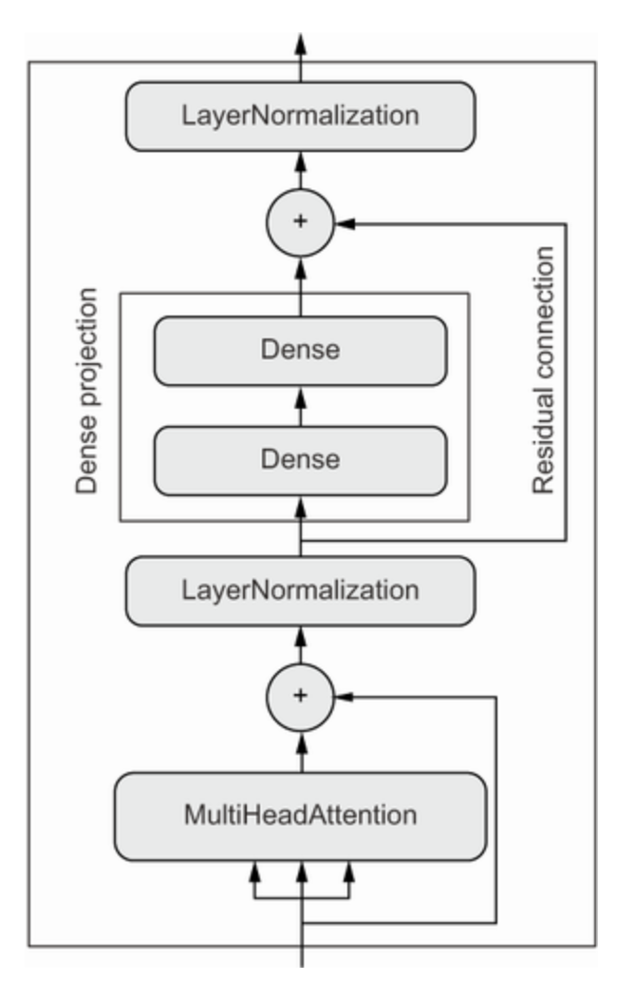
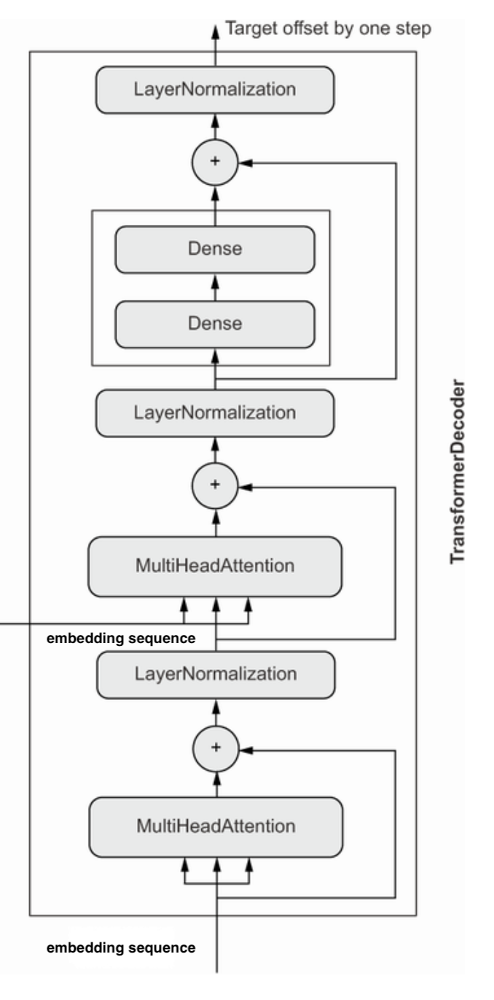
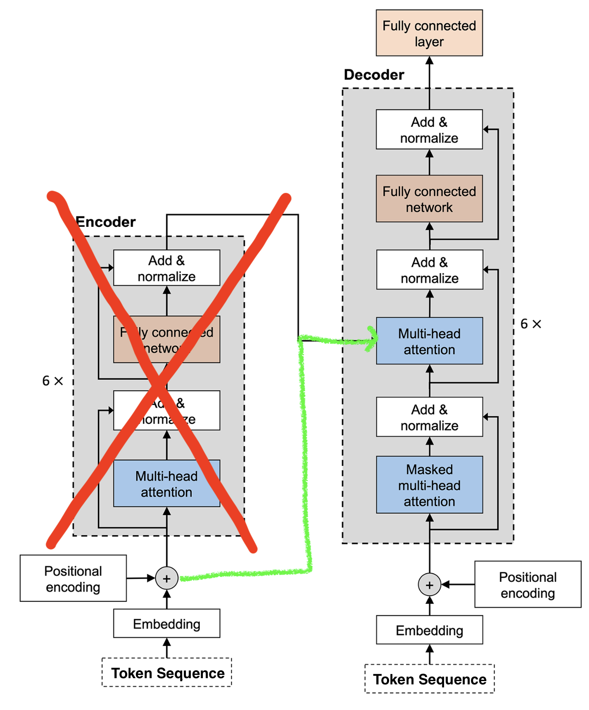
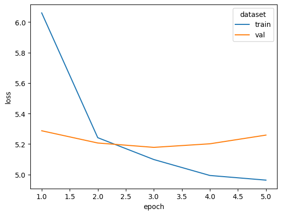

## The story of one man's mission not to get left behind in the dust

---

This presentation is based on the codebase at [github.com/AlexIoannides/transformer-gen-ai](https://github.com/AlexIoannides/transformers-gen-ai).

I'm not going to assume you've worked through it, but if you have and there are questions you want to ask, then please do 🙂

---

The repo contains the source code for a Python package called `modelling`. This implements a generative transformer model and the tools to use it. Examples are contained in a series of notebooks.

{width=60%}

---

The aim was to develop a platform for understanding how transformer models work, together with the (ML) engineering challenges that they pose. 

This talk is the abridged version of this work.

---

This project made heavy use of the [PyTorch](https://pytorch.org/docs/stable/index.html) tensor computation framework and its ecosystem. If you want to learn how to use this, try starting with the [introduction on my personal website](https://alexioannides.com/notes-and-demos/pytorch/)

{width=50%}

## What I'm intending to talk about

::: incremental

1. The problem domain
2. How to compute multi-head attention.
3. Transformers: encoders, decoders, and all that.
4. How I developed a generative LLM.
5. Exciting things to try with this LLM.

:::

## The problem domain

---

The state of applied NLP in 2023 (according to Alex)

{width=60%}

___

The role that attention plays in all this...



## How to compute multi-head attention

### Let's start with self-attention & a single head

---

```python
import math

import torch
import torch.nn as nn
import torch.nn.functional as F

VOCAB_SIZE = 20000
EMBEDDING_DIM = 32


# Let's assume some tokenizer has tokenised our sentence.
tokenized_sentence = torch.randint(0, vocab_size, 8)
n_tokens = len(tokenized_sentence)

# We then map from token to embeddings.
embedding_layer = nn.Embedding(VOCAB_SIZE, EMBEDDING_DIM)
embedded_tokens = embedding_layer(tokenized_sentence)

# And compute self-attention weights.
attn_weights = torch.empty(n_tokens, n_tokens)
for i in range(n_tokens):
    for j in range(n_tokens):
        attn_weights[i, j] = torch.dot(embedded_tokens[i], embedded_tokens[j])

# Normalise the weights, so that they sun to 1.0.
attn_weights_norm = F.softmax(attn_weights / math.sqrt(EMBEDDING_DIM), dim=1)

# And finally use the weights to compute context-aware embeddings.
context_weighted_embeddings = torch.matmul(attn_weights_norm, embedded_tokens)
```

---

More formally...

$$
\vec{x_{i}} \to \vec{z_{i}} = \sum_{j=1}^{N}{a_{ij} \times \vec{x_{j}}}
$$

i.e., we build new embeddings using semantic similarity to selectively pool information from the original embeddings. Note, there aren't any attention-specific parameters that need to be learnt, only the original embeddings. We'll come back to this later.

### Time and causality

In the current setup, the attention-modulated embedding at time $t_1$ is a function of embeddings for tokens that come after. If we want to develop generative models, then this isn't appropriate. A common solution is to use **causal masking**.

___



```python
causal_mask = torch.triu(torch.full((n_tokens, n_tokens), True), diagonal=1)
causal_attn_weights = attn_weights.masked_fill(causal_mask, -1e10)
causal_attn_weights_norm = F.softmax(causal_attn_weights / math.sqrt(EMBEDDING_DIM), dim=1)
```

---

### Learning how to attend

```python
# Define three linear transformations.
u_q = torch.rand(n_tokens, n_tokens)
u_k = torch.rand(n_tokens, n_tokens)
u_v = torch.rand(n_tokens, n_tokens)

# Use these to transform the embedded tokens.
q = torch.matmul(u_q, embedded_tokens)
k = torch.matmul(u_k, embedded_tokens)
v = torch.matmul(u_v, embedded_tokens)

# And then re-work the computation of the attention weights.
attn_weights_param = torch.empty(n_tokens, n_tokens)

for i in range(n_tokens):
    for j in range(n_tokens):
        attn_weights_param[i, j] = torch.dot(q[i], k[j])

attn_weights_param_norm = F.softmax(
    attn_weights_param / math.sqrt(EMBEDDING_DIM), dim=1
)
context_weighted_embeddings_param = torch.matmul(attn_weights_param_norm, v)
```

This is equivalent to passing `embedded_tokens` through three separate linear network layers and using the outputs within the self-attention mechanism.

---

More formally...

$$
a_{ij} \to b_{ij} = c \times \vec{q_{i}} \cdot \vec{k_{i}}
$$

Where $c$ is a normalisation constant. Thus,

$$
\vec{x_{i}} \to \vec{z_{i}} = \sum_{j=1}^{N}{b_{ij} \times \vec{v_{j}}}
$$

---

*Conceptially* inspired by...

{width=50%}

i.e., we learn how to map a sequence of embeddings into queries, keys and values 🤨

### From single to multiple attention heads



---

“*The 'Attention is all you need' paper was written at a time when the idea of factoring feature spaces into independent subspaces had been shown to provide great benefits for computer vision models... Multi-head attention is simply the application of the same idea to self-attention.*"

\- François Chollet (the author of Keras)

___

We have now arrived at

`torch.nn.MultiheadAttention`

## Transformers: encoders, decoders, and all that

___

How do we arrive at

`torch.nn.TransformerEncoderLayer`
`torch.nn.TransformerDecoderLayer`

?

---

An encoder block:

{width=35%}

---

"*... adding residual connections, adding normalization layers—all of these are standard architecture patterns that one would be wise to leverage in any complex model. Together, these bells and whistles form the Transformer encoder—one of two critical parts that make up the Transformer architecture*”

\- François Chollet (the author of Keras)

---

"*We stare into the void where our math fails us and try to write math papers anyway... We could then turn to the deepness itself and prove things about batch norm or dropout or whatever, but these just give us some nonpredictive post hoc justifications... deep learning seems to drive people completely insane.*"

\- [Ben Recht](https://argmin.substack.com/p/my-mathematical-mind) (Prof. of Computer Sciences, UC Berkley)

___

A decoder block:

{width=20%}

Note → two multi-head attention blocks and the embedding sequence is added back in as the values 🤔

___

### When do we use encoders, decoders, or both?

::: incremental

- **Encoder**: pure embedding models.
- **Decoder**: generative models.
- **Encoder + Decoder**: sequence-to-sequence models.

:::

## How I developed a generative LLM

### The data

50k film reviews and sentiment scores from IMDB.

```python
from torch.nn.utils.rnn import pad_sequence
from torch.utils.data import DataLoader, IterableDataset
from torchtext.datasets import IMDB
from torchtext.vocab import vocab

from modelling.data import (
    FilmReviewSequences,
    IMDBTokenizer,
    get_data,
    make_chunks,
    make_sequence_datasets,
    pad_seq2seq_data,
)


data = get_data()
data.head(10)

# sentiment	review
# 0	0	Forget what I said about Emeril. Rachael Ray i...
# 1	0	Former private eye-turned-security guard ditch...
# 2	0	Mann photographs the Alberta Rocky Mountains i...
# 3	0	Simply put: the movie is boring. Cliché upon c...
# 4	1	Now being a fan of sci fi, the trailer for thi...
# 5	1	In 'Hoot' Logan Lerman plays Roy Eberhardt, th...
# 6	0	This is the worst film I have ever seen.I was ...
# 7	1	I think that Toy Soldiers is an excellent movi...
# 8	0	I think Micheal Ironsides acting career must b...
# 9	0	This was a disgrace to the game FarCry i had m...
```

---

Example #4 in full:

*"Now being a fan of sci fi, the trailer for this film looked a bit too, how do i put it, hollywood. But after watching it i can gladly say it has impressed me greatly. Jude is a class actor and miss Leigh pulls it off better than she did in Delores Clairborne. It brings films like The Matrix, 12 Monkeys and The Cell into mind, which might not sound that appealing, but it truly is one of the best films i have seen."*

___

### Chunking

Most reviews are too long to be used as one input sequence and need to be broken into chunks. I chose a strategy based on preserving sentence integrity to create overlapping chunks that fall within a maximum sequence length.

--- 

Example with maximum sequence length of 30 words:

```python
full_text = """I've seen things you people wouldn't believe. Attack ships on fire off
the shoulder of Orion. I watched C-beams glitter in the dark near the Tannhäuser Gate.
All those moments will be lost in time, like tears in rain."""

chunk_one = """I've seen things you people wouldn't believe. Attack ships on fire off
the shoulder of Orion. I watched C-beams glitter in the dark near the Tannhäuser Gate."""

chunk_three = """Attack ships on fire off the shoulder of Orion. I watched C-beams
glitter in the dark near the Tannhäuser Gate."""

chunk_four = """I watched C-beams glitter in the dark near the Tannhäuser Gate. All
those moments will be lost in time, like tears in rain."""
```

### Generating tokens

```python
class IMDBTokenizer(_Tokenizer):
    """Word to integer tokenization for use with any dataset or model."""

    def __init__(self, reviews: list[str], min_word_freq: int = 1):
        reviews_doc = " ".join(reviews)
        token_counter = Counter(self._tokenize(reviews_doc))
        token_freqs = sorted(token_counter.items(), key=lambda e: e[1], reverse=True)
        _vocab = vocab(OrderedDict(token_freqs), min_freq=min_word_freq)
        _vocab.insert_token("<pad>", PAD_TOKEN_IDX)
        _vocab.insert_token("<unk>", UNKOWN_TOKEN_IDX)
        _vocab.set_default_index(1)
        self.vocab = _vocab
        self.vocab_size = len(self.vocab)

    def text2tokens(self, text: str) -> list[int]:
        return self.vocab(self._tokenize(text))

    def tokens2text(self, tokens: list[int]) -> str:
        text = " ".join(self.vocab.lookup_tokens(tokens))
        text = re.sub(rf"\s{EOS_TOKEN}", ".", text)
        return text.strip()

    @staticmethod
    def _tokenize(text: str) -> list[str]:
        text = IMDBTokenizer._standardise(text)
        text = (". ".join(sentence.strip() for sentence in text.split("."))).strip()
        text = re.sub(r"\.", f" {EOS_TOKEN} ", text)
        text = re.sub(r"\s+", " ", text)
        return text.split()

    ...
```

---

```python
class IMDBTokenizer(_Tokenizer):
    """Word to integer tokenization for use with any dataset or model."""

    ...

    @staticmethod
    def _standardise(text: str) -> str:
        """Remove punctuation, HTML and make lower case."""
        text = text.lower().strip()
        text = unidecode(text)
        text = re.sub(r"<[^>]*>", "", text)
        text = re.sub(r"mr.", "mr", text)
        text = re.sub(r"mrs.", "mrs", text)
        text = re.sub(r"ms.", "ms", text)
        text = re.sub(r"(\!|\?)", ".", text)
        text = re.sub(r"-", " ", text)
        text = "".join(
            char for char in text if char not in "\"#$%&'()*+,/:;<=>@[\\]^_`{|}~"
        )
        text = re.sub(r"\.+", ".", text)
        return text
```

---

`IMDBTokenizer` in action

```python
reviews = data["review"].tolist()
review = reviews[0]

tokenizer = IMDBTokenizer(reviews)
tokenized_review = tokenizer(review)
tokenised_review_decoded = tokenizer.tokens2text(tokenized_review[:10])

print(f"ORIGINAL TEXT: {review[:47]} ...")
print(f"TOKENS FROM TEXT: {', '.join(str(t) for t in tokenized_review[:10])} ...")
print(f"TEXT FROM TOKENS: {tokenised_review_decoded} ...")

# ORIGINAL TEXT: Forget what I said about Emeril. Rachael Ray is ...
# TOKENS FROM TEXT: 831, 49, 11, 300, 44, 37877, 3, 10505, 1363, 8 ...
# TEXT FROM TOKENS: forget what i said about emeril. rachael ray is ...
```

This is adequate for the current endeavor, but serious models use more sophisticated tokenisation algorithms, such as [Byte-Pair Encoding (BPE)](https://huggingface.co/learn/nlp-course/chapter6/5?fw=pt), which is one of the 'secret ingredients' of OpenAI's GPT models.

### Datasets and DataLoaders

PyTorch provides a framework for composing portable data pipelines that can be used with any model.

`torch.utils.data.Dataset`
`torch.utils.data.IterableDataset`
`torch.utils.data.DataLoader`

Our pipeline delivers pairs of token sequences with an offset of one token between them.

```python
tokenized_reviews = [tokenizer(review) for review in reviews]
dataset = FilmReviewSequences(tokenized_reviews)
x, y = next(iter(dataset))

print(f"x[:5]: {x[:5]}")
print(f"y[:5]: {y[:5]}")

# x[:5]: tensor([831,  49,  11, 300,  44])
# y[:5]: tensor([   49,    11,   300,    44, 37877])
```

---

```python
class FilmReviewSequences(IterableDataset):
    """IMDB film reviews for training generative models."""

    def __init__(
        self,
        tokenized_reviews: Iterable[list[int]],
        max_seq_len: int = 40,
        min_seq_len: int = 20,
        chunk_eos_token: int | None = None,
        chunk_overlap: bool = True,
        tag: str = "data",
    ):
        self._data_file_path = TORCH_DATA_STORAGE_PATH / f"imdb_sequences_{tag}.json"

        with open(self._data_file_path, mode="w") as file:
            if chunk_eos_token:
                for tok_review in tokenized_reviews:
                    tok_chunks_itr = make_chunks(
                        tok_review,
                        chunk_eos_token,
                        max_seq_len,
                        min_seq_len,
                        chunk_overlap
                    )
                    for tok_chunk in tok_chunks_itr:
                        file.write(json.dumps(tok_chunk) + "\n")
            else:
                for tok_review in tokenized_reviews:
                    file.write(json.dumps(tok_review[:max_seq_len]) + "\n")

    ...
```

---

```python
class FilmReviewSequences(IterableDataset):
    """IMDB film reviews for training generative models."""

    ...

    def __iter__(self) -> Iterable[tuple[Tensor, Tensor]]:
        with open(self._data_file_path) as file:
            for line in file:
                tokenized_chunk = json.loads(line)
                yield (tensor(tokenized_chunk[:-1]), tensor(tokenized_chunk[1:]))

    def __len__(self) -> int:
        with open(self._data_file_path) as file:
            num_rows = sum(1 for line in file)
        return num_rows
```

Note, the entire dataset it not held in memory, but is loaded from disk on-demand in an attempt to optimize memory during training.

---

Use `DataLoader` to batch data and handle parallelism.

```python
def pad_seq2seq_data(batch: list[tuple[int, int]]) -> tuple[Tensor, Tensor]:
    """Pad sequence2sequence data tuples."""
    x = [e[0] for e in batch]
    y = [e[1] for e in batch]
    x_padded = pad_sequence(x, batch_first=True)
    y_padded = pad_sequence(y, batch_first=True)
    return x_padded, y_padded


data_loader = DataLoader(datasets.test_data, batch_size=10, collate_fn=pad_seq2seq_data)

data_batches = [batch for batch in data_loader]
x_batch, y_batch = data_batches[0]

print(f"x_batch_size = {x_batch.size()}")
print(f"y_batch_size = {y_batch.size()}")
# x_batch_size = torch.Size([10, 38])
# y_batch_size = torch.Size([10, 38])
```

### GPUs

Models were trained using one of

{width=15%}

{width=15%}

---

My approach was to use the best available device for a given model. Note that sometimes `mps` is slower than `cpu` (until Apple get their act together).

```python
from torch import device


def get_best_device(
        cuda_priority: Literal[1, 2, 3] = 1,
        mps_priority: Literal[1, 2, 3] = 2,
        cpu_priority: Literal[1, 2, 3] = 3,
    ) -> device:
    """Return the best device available on the machine."""
    device_priorities = sorted(
        (("cuda", cuda_priority), ("mps", mps_priority), ("cpu", cpu_priority)),
        key=lambda e: e[1]
    )
    for device_type, _ in device_priorities:
        if device_type == "cuda" and cuda.is_available():
            return device("cuda")
        elif device_type == "mps" and mps.is_available():
            return device("mps")
        elif device_type == "cpu":
            return device("cpu")
```

## RNN benchmark model


---

Define the model:

```python
from torch import Tensor, device, manual_seed, no_grad, tensor, zeros
from torch.nn import LSTM, CrossEntropyLoss, Embedding, Linear, Module
from torch.optim import Adam, Optimizer
from torch.utils.data import DataLoader


class NextWordPredictionRNN(Module):
    """LSTM for predicting the next token in a sequence."""

    def __init__(self, size_vocab: int, size_embed: int, size_hidden: int):
        super().__init__()
        self._size_hidden = size_hidden
        self._embedding = Embedding(size_vocab, size_embed)
        self._lstm = LSTM(size_embed, size_hidden, batch_first=True)
        self._linear = Linear(size_hidden, size_vocab)

    def forward(self, x: Tensor, hidden: Tensor, cell: Tensor) -> Tensor:
        out = self._embedding(x).unsqueeze(1)
        out, (hidden, cell) = self._lstm(out, (hidden, cell))
        out = self._linear(out).reshape(out.shape[0], -1)
        return out, hidden, cell

    def initialise(self, batch_size: int, device_: device) -> Tuple[Tensor, Tensor]:
        hidden = zeros(1, batch_size, self._size_hidden, device=device_)
        cell = zeros(1, batch_size, self._size_hidden, device=device_)
        return hidden, cell
```

---

Example output:

```python
dummy_token = torch.tensor([42])

hidden_t0, cell_t0 = model.initialise(1, torch.device("cpu"))
output_token_logit, hidden_t1, cell_t1 = model(dummy_token, hidden_t0, cell_t0)

print(output_token_logit.size())
# torch.Size([1, 69014])
```

Note → can only process one token at a time.

---

Define a single training step:

```python
def _train_step(
    x_batch: Tensor,
    y_batch: Tensor,
    model: Module,
    loss_fn: Callable[[Tensor, Tensor], Tensor],
    optimizer: Optimizer,
    device: device,
) -> Tensor:
    """One iteration of the training loop (for one batch)."""
    model.train()
    batch_size, sequence_length = x_batch.shape

    loss_batch = tensor(0.0, device=device)
    optimizer.zero_grad(set_to_none=True)

    hidden, cell = model.initialise(batch_size, device)
    for n in range(sequence_length):
        y_pred, hidden, cell = model(x_batch[:, n], hidden, cell)
        loss_batch += loss_fn(y_pred, y_batch[:, n])
    loss_batch.backward()
    optimizer.step()

    return loss_batch / sequence_length
```

---

Define a single validation step:

```python
@no_grad()
def _val_step(
    x_batch: Tensor,
    y_batch: Tensor,
    model: Module,
    loss_fn: Callable[[Tensor, Tensor], Tensor],
    device: device,
) -> Tensor:
    """One iteration of the validation loop (for one batch)."""
    model.eval()
    batch_size, sequence_length = x_batch.shape

    loss_batch = tensor(0.0, device=device)

    hidden, cell = model.initialise(batch_size, device)
    for n in range(sequence_length):
        y_pred, hidden, cell = model(x_batch[:, n], hidden, cell)
        loss_batch += loss_fn(y_pred, y_batch[:, n])

    return loss_batch / sequence_length
```

---

Define the full training routine:

```python
def train(
    model: Module,
    train_data: DataLoader,
    val_data: DataLoader,
    n_epochs: int,
    learning_rate: float = 0.001,
    random_seed: int = 42,
    device: device = get_best_device(),
) -> Tuple[Dict[int, float], Dict[int, float], ModelCheckpoint]:
    """Training loop for LTSM flavoured RNNs on sequence data."""
    manual_seed(random_seed)
    model.to(device)

    optimizer = Adam(model.parameters(), lr=learning_rate)
    loss_fn = CrossEntropyLoss(ignore_index=PAD_TOKEN_IDX)

    train_losses: Dict[int, float] = {}
    val_losses: Dict[int, float] = {}

    ...

```

---

```python
def train(...) -> Tuple[Dict[int, float], Dict[int, float], ModelCheckpoint]:
    """Training loop for LTSM flavoured RNNs on sequence data."""

    ...

    for epoch in range(1, n_epochs + 1):
        loss_train = tensor(0.0).to(device)
        for i, (x_batch, y_batch) in enumerate((pbar := tqdm(train_data)), start=1):
            x = x_batch.to(device, non_blocking=True)
            y = y_batch.to(device, non_blocking=True)
            loss_train += _train_step(x, y, model, loss_fn, optimizer, device)
            pbar.set_description(f"epoch {epoch} training loss = {loss_train/i:.4f}")

        loss_val = tensor(0.0).to(device)
        for x_batch, y_batch in val_data:
            x = x_batch.to(device, non_blocking=True)
            y = y_batch.to(device, non_blocking=True)
            loss_val += _val_step(x, y, model, loss_fn, device)

        epoch_train_loss = loss_train.item() / len(train_data)
        epoch_val_loss = loss_val.item() / len(val_data)

        if epoch == 1 or epoch_val_loss < min(val_losses.values()):
            best_checkpoint = ModelCheckpoint(
                epoch, epoch_train_loss, epoch_val_loss, model.state_dict().copy()
            )
        train_losses[epoch] = epoch_train_loss
        val_losses[epoch] = epoch_val_loss

        if _early_stop(val_losses):
            break

    ...

```

---

```python
def train(...) -> Tuple[Dict[int, float], Dict[int, float], ModelCheckpoint]:
    """Training loop for LTSM flavoured RNNs on sequence data."""

    ...

    print("\nbest model:")
    print(f"|-- epoch: {best_checkpoint.epoch}")
    print(f"|-- validation loss: {best_checkpoint.val_loss:.4f}")

    model.load_state_dict(best_checkpoint.state_dict)
    return train_losses, val_losses, best_checkpoint
```

---

Train the model:

```python
# Hyper-parameters that lead to a model with 215,234 parameters.
SIZE_EMBED = 256
SIZE_HIDDEN = 512

MAX_EPOCHS = 30
BATCH_SIZE = 256
MAX_SEQ_LEN = 100
MIN_SEQ_LEN = 10
MIN_WORD_FREQ = 2
LEARNING_RATE = 0.005
```

---

{width=50%}

```text
epoch 1 training loss = 5.4329: 100%|██████████| 2105/2105 [2:31:20<00:00,  4.31s/it]  
epoch 2 training loss = 4.8774: 100%|██████████| 2105/2105 [2:30:43<00:00,  4.30s/it]  
epoch 3 training loss = 4.6274: 100%|██████████| 2105/2105 [2:31:16<00:00,  4.31s/it]  
epoch 4 training loss = 4.4552: 100%|██████████| 2105/2105 [2:30:40<00:00,  4.29s/it]  

best model:
|-- epoch: 2
|-- validation loss: 5.0893
```

---

### Text generation strategies

{width=75%}

---

#### Comomon algorithms

```python
def _sample_decoding(logits: Tensor, temperature: float = 1.0) -> Tensor:
    """Generate next token using sample decoding strategy."""
    return Categorical(logits=logits.squeeze() / temperature).sample()


def _top_k_decoding(logits: Tensor, temperature: float = 1.0, k: int = 3) -> Tensor:
    """Generate next token using top-k decoding strategy."""
    token_probs = Categorical(logits=logits.squeeze() / temperature).probs
    top_k_tokens = topk(token_probs, k=k)
    sampled_token = Categorical(probs=top_k_tokens.values).sample()
    return top_k_tokens.indices[sampled_token]


def _greedy_decoding(logits: Tensor, temperature: float = 1.0) -> Tensor:
    """Generate next token using greedy decoding strategy."""
    token_probs = Categorical(logits=logits.squeeze() / temperature).probs
    return argmax(token_probs)


def decode(
    token_logits: Tensor,
    strategy: Literal["greedy", "sample", "topk"] = "greedy",
    temperature: float = 1.0,
    *,
    k: int = 5,
) -> Tensor:
    """Decode generative model output using the specified strategy."""
    match strategy:
        case "greedy":
            return _greedy_decoding(token_logits, temperature)
        case "topk":
            return _top_k_decoding(token_logits, temperature, k)
        case "sample":
            return _sample_decoding(token_logits, temperature)
```

### Generating text from the RNN model

```python
def generate(
    model: NextWordPredictionRNN,
    prompt: str,
    tokenizer: _Tokenizer,
    strategy: Literal["greedy", "sample", "topk"] = "greedy",
    output_length: int = 60,
    temperature: float = 1.0,
    random_seed: int = 42,
    device: device = get_best_device(),
    *,
    k: int = 2,
) -> str:
    """Generate new text conditional on a text prompt."""
    manual_seed(random_seed)

    model.to(device)
    model.eval()

    prompt_tokens = tokenizer(prompt)

    # Feed tokenised prompt into model.
    hidden, cell = model.initialise(1, device)
    for token in prompt_tokens[:-1]:
        x = tensor([token], device=device)
        _, hidden, cell = model(x, hidden, cell)

    # Then predict the next token, add it to the sequence, and iterate
    token_sequence = prompt_tokens.copy()
    for _ in range(output_length):
        x = tensor([token_sequence[-1]], device=device)
        token_logits, hidden, cell = model(x, hidden, cell)
        token_pred = decode(token_logits, strategy, temperature, k=k)
        token_sequence += [token_pred.item()]

    new_token_sequence = token_sequence[len(prompt_tokens) :]
    return format_generated_words(tokenizer.tokens2text(new_token_sequence), prompt)
```

---

Start with an untrained model as a reference point:

```python
prompt = "This is a classic horror and"

# ==> THIS IS A CLASSIC HORROR AND numerically unsavory aiken pyewacket nagase comparative
# dave compounded surfboards seemsdestined chekhov interdiction prussic hunh kosugis
# germanys sole filmsfor sedimentation albino 2036 krug zefferelli djalili baldwins chowder
# strauss shutes haifa seeming 101st mrbumble grandmas noll bulgarias lenders repressed
# deneuve ounce emphasise salome tracking avian mrmyagi megalopolis countries dolorous
# fairview dying subtitle appointed dollar opting energized tremell cya slinging riot
# seemsslow secaucus muco forgo mediation patio flogs armsin sbaraglia snowflake usurps
# roadmovie slogans holy vanishes zuckers herrmann encyclopedia dorma chapas fairview whit
# mergers katie motherhood ejaculation stepehn nat unremitting munched munched sceneand
# jarhead skaal broadcasted pottery admonition lewbert upholding neat projectile bjork...
```

---

Then take a look at what a top-5 decoding strategy yields with the trained model:

```python
prompt = "This is a classic horror and"

# ==> THIS IS A CLASSIC HORROR AND the story is a bit of a letdown. The story is told in
# some ways. The only redeeming feature in the whole movie is that its not a good idea. Its
# a wonderful story with a very limited performance and the music and the script. The story
# is not that bad. The story is not a spoiler. The story is a little slow but its not the
# best one to come to mind of mencia. Its not a movie to watch. It is a good film to watch.
# Its not....
```

## Generative decoder model

{width=45%}

### Positional encoding

```python
class PositionalEncoding(Module):
    """Position encoder taken from 'Attention is all you Need'."""

    def __init__(self, size_embed: int, dropout: float = 0.1, max_seq_len: int = 1000):
        super().__init__()
        self._dropout = Dropout(p=dropout)

        position = arange(max_seq_len).unsqueeze(1)
        div_term = exp(arange(0, size_embed, 2) * (-log(tensor(10000.0)) / size_embed))
        pos_encoding = zeros(max_seq_len, size_embed)
        pos_encoding[:, 0::2] = sin(position * div_term)
        pos_encoding[:, 1::2] = cos(position * div_term)
        self.register_buffer("_pos_encoding", pos_encoding)  # don't train these

    def forward(self, x: Tensor) -> Tensor:
        """
        Arguments:
            x: Tensor, shape ``[batch_size, seq_len, embedding_dim]``
        """
        seq_len = x.size(1)
        x = x + self._pos_encoding[:seq_len]
        return self._dropout(x)
```

Analagous to adding a watermark to each embedded token, to indicate its position in the sequence.

---

Define the model:

```python
class NextWordPredictionTransformer(Module):
    """Transformer for predicting the next tokens in a sequence."""

    def __init__(self, size_vocab: int, size_embed: int, n_heads: int = 1):
        super().__init__()
        self._size_vocab = size_vocab
        self._size_embed = size_embed
        self._n_heads = n_heads
        self._position_encoder = PositionalEncoding(size_embed)
        self._embedding = Embedding(size_vocab, size_embed)
        self._decoder = TransformerDecoderLayer(
            size_embed, n_heads, dim_feedforward=2 * size_embed, batch_first=True
        )
        self._linear = Linear(size_embed, size_vocab)
        self._init_weights()

    def forward(self, x: Tensor) -> Tensor:
        x_causal_mask, x_padding_mask = self._make_mask(x)
        out = self._embedding(x) * sqrt(tensor(self._size_embed))
        out = self._position_encoder(out)
        out = self._decoder(
            out,
            out,
            tgt_mask=x_causal_mask,
            tgt_key_padding_mask=x_padding_mask,
            memory_mask=x_causal_mask,
            memory_key_padding_mask=x_padding_mask,
        )
        out = self._linear(out)
        return out

    ...
```

---

```python
class NextWordPredictionTransformer(Module):
    """Transformer for predicting the next tokens in a sequence."""

    ...

    def _init_weights(self) -> NextWordPredictionTransformer:
        """Parameter initialisaion from Attention is all you Need."""
        for p in self.parameters():
            if p.dim() > 1:
                xavier_uniform_(p)
        return self

    def _make_mask(self, x: Tensor) -> tuple[Tensor, Tensor]:
        """Make causal and padding masks."""
        causal_mask = ones(x.size(0) * self._n_heads, x.size(1), x.size(1))
        causal_mask = tril(causal_mask) == 0
        padding_mask = x == PAD_TOKEN_IDX
        return causal_mask.to(x.device), padding_mask.to(x.device)
```

---

Example output:

```python
dummy_token_sequence = torch.tensor([[42, 42, 42]])

output_seq_logits = model(dummy_token_sequence)

print(output_seq_logits.size())
# torch.Size([1, 3, 69014])
```

Note → can process entire sequences at once.

---

Define a single training step:

```python
def _train_step(
    x_batch: Tensor,
    y_batch: Tensor,
    model: Module,
    loss_fn: Callable[[Tensor, Tensor], Tensor],
    optimizer: Optimizer,
    lr_scheduler: LRScheduler,
    clip_grads: float | None = None,
) -> Tensor:
    """One iteration of the training loop (for one batch)."""
    model.train()
    y_pred = model(x_batch)
    loss_batch = loss_fn(y_pred.permute(0, 2, 1), y_batch)

    optimizer.zero_grad(set_to_none=True)
    loss_batch.backward()
    if clip_grads:
        clip_grad_norm_(model.parameters(), clip_grads)
    optimizer.step()
    lr_scheduler.step()

    return loss_batch
```

---

Define a single validation step:

```python
@no_grad()
def _val_step(
    x_batch: Tensor,
    y_batch: Tensor,
    model: Module,
    loss_fn: Callable[[Tensor, Tensor], Tensor],
) -> Tensor:
    """One iteration of the validation loop (for one batch)."""
    model.eval()
    y_pred = model(x_batch)
    loss_batch = loss_fn(y_pred.permute(0, 2, 1), y_batch)
    return loss_batch
```

---

Set a learning rate schedule:


```python
def warmup_schedule(step: int, warmup_steps: int, max_steps: int):
    """Learning rate schedule function taken from GPT-1 paper."""
    lr_factor = 0.5 * (1 + math.cos(math.pi * step / max_steps))
    if step <= warmup_steps:
        lr_factor *= step / warmup_steps
    return lr_factor
```

---

Define the full training routine:

```python
def train(
    model: Module,
    train_data: DataLoader,
    val_data: DataLoader,
    n_epochs: int,
    learning_rate: float = 0.001,
    warmup_epochs: float = 0.5,
    clip_grads: float | None = None,
    random_seed: int = 42,
    device: device = get_best_device(cuda_priority=1, mps_priority=3, cpu_priority=2),
) -> Tuple[dict[int, float], dict[int, float], ModelCheckpoint]:
    """Training loop for transformer decoder."""
    manual_seed(random_seed)
    model.to(device)

    optimizer = Adam(model.parameters(), lr=learning_rate)
    loss_fn = CrossEntropyLoss(ignore_index=PAD_TOKEN_IDX)

    n_batches = len(train_data)
    n_warmup_steps = math.floor(warmup_epochs * n_batches)
    n_steps = n_epochs * n_batches
    lrs_fn = partial(warmup_schedule, warmup_steps=n_warmup_steps, max_steps=n_steps)
    lrs = LambdaLR(optimizer, lrs_fn)

    train_losses: dict[int, float] = {}
    val_losses: dict[int, float] = {}

    ...
```

---

```python
def train(...) -> Tuple[Dict[int, float], Dict[int, float], ModelCheckpoint]:
    """Training loop for LTSM flavoured RNNs on sequence data."""

    ...

    print(f"number of warmup steps: {n_warmup_steps} / {n_steps}")
    for epoch in range(1, n_epochs + 1):
        loss_train = tensor(0.0).to(device)
        for i, (x_batch, y_batch) in enumerate((pbar := tqdm(train_data)), start=1):
            x = x_batch.to(device, non_blocking=True)
            y = y_batch.to(device, non_blocking=True)
            loss_train += _train_step(x, y, model, loss_fn, optimizer, lrs, clip_grads)
            lr = lrs.get_last_lr()[0]
            pbar.set_description(
                f"epoch {epoch} training loss = {loss_train/i:.4f} (LR = {lr:.8f})"
            )

        loss_val = tensor(0.0).to(device)
        for x_batch, y_batch in val_data:
            x = x_batch.to(device, non_blocking=True)
            y = y_batch.to(device, non_blocking=True)
            loss_val += _val_step(x, y, model, loss_fn)

        epoch_train_loss = loss_train.item() / len(train_data)
        epoch_val_loss = loss_val.item() / len(val_data)

        if epoch == 1 or epoch_val_loss < min(val_losses.values()):
            best_checkpoint = ModelCheckpoint(
                epoch, epoch_train_loss, epoch_val_loss, model.state_dict().copy()
            )

        train_losses[epoch] = epoch_train_loss
        val_losses[epoch] = epoch_val_loss

        if _early_stop(val_losses):
            break

    ...

```

---

```python
def train(...) -> Tuple[Dict[int, float], Dict[int, float], ModelCheckpoint]:
    """Training loop for LTSM flavoured RNNs on sequence data."""

    ...

    print("\nbest model:")
    print(f"|-- epoch: {best_checkpoint.epoch}")
    print(f"|-- validation loss: {best_checkpoint.val_loss:.4f}")

    model.load_state_dict(best_checkpoint.state_dict)
    return train_losses, val_losses, best_checkpoint
```

---

Train the model:

```python
# Hyper-parameters that lead to a model with 214,210 parameters.
SIZE_EMBED = 256

MAX_EPOCHS = 30
BATCH_SIZE = 32
MAX_SEQ_LEN = 100
MIN_SEQ_LEN = 10
MIN_WORD_FREQ = 2
MAX_LEARNING_RATE = 0.001
WARMUP_EPOCHS = 2
GRADIENT_CLIP = 5
```

---

{width=50%}

```text
number of warmup steps: 33692 / 505380
epoch 1 training loss = 5.9463 (LR = 0.00049863): 100%|██████████| 16846/16846 [51:35<00:00,  5.44it/s]
epoch 2 training loss = 5.1662 (LR = 0.00098907): 100%|██████████| 16846/16846 [51:32<00:00,  5.45it/s]
epoch 3 training loss = 5.0460 (LR = 0.00097553): 100%|██████████| 16846/16846 [51:32<00:00,  5.45it/s]
epoch 4 training loss = 4.9569 (LR = 0.00095677): 100%|██████████| 16846/16846 [51:32<00:00,  5.45it/s]
epoch 5 training loss = 4.9277 (LR = 0.00093301): 100%|██████████| 16846/16846 [51:33<00:00,  5.45it/s]

best model:
|-- epoch: 3
|-- validation loss: 5.0740
```

### Generating text from the decoder model

```python
def generate(
    model: NextWordPredictionTransformer,
    prompt: str,
    tokenizer: _Tokenizer,
    strategy: Literal["greedy", "sample", "topk"] = "greedy",
    output_length: int = 60,
    temperature: float = 1.0,
    random_seed: int = 42,
    device: device = get_best_device(),
    *,
    k: int = 2,
) -> str:
    """Generate new text conditional on a text prompt."""
    manual_seed(random_seed)

    model.to(device)
    model.eval()

    prompt_tokens = tokenizer(prompt)
    token_sequence = prompt_tokens.copy()
    for _ in range(output_length):
        x = tensor([token_sequence], device=device)
        token_logits = model(x)
        token_pred = decode(token_logits[0, -1], strategy, temperature, k=k)
        token_sequence += [token_pred.item()]

    new_token_sequence = token_sequence[len(prompt_tokens) :]
    new_token_sequence = token_sequence[len(prompt_tokens) :]
    return format_generated_words(tokenizer.tokens2text(new_token_sequence), prompt)
```

---

Start with an untrained model as a reference point:

```python
prompt = "This is a classic horror and"

# ==> THIS IS A CLASSIC HORROR AND tsa tsa tsa wiimote wiimote upclose upclose upclose
# naturalism upfront upfront upfront 1930the punctuation indiscernible upfront upfront
# upfront upfront upfront upfront upfront granting whining nazarin certo certo certo
# upfront perine perine centralized neurological neurological neurological crestfallen
# crestfallen allfor neurological neurological neurological cassavetess perine perine
# laughter laughter laughter laughter certo certo yorkavant yorkavant lacing lacing lacing
# lacing allfor boredome yorkavant boredome yorkavant jobmore savannahs neurological
# neurological lunchmeat badmen yorkavant yorkavant yorkavant thousands thousands thousands
# thousands thousands yorkavant thousands thousands forego forego world 1930the 1930the
# 1930the 1930the 1930the 1930the world world thousands kinkle centralized centralized
# centralized earnings earnings earnings allyway allyway xian...
```

---

Then take a look at what a top-5 decoding strategy yields with the trained model:

```python
prompt = "This is a classic horror and"

# ==> THIS IS A CLASSIC HORROR AND a good story with the great cast. Its a shame that the
# story has been a bit of one night of my favourite actors. This is an amazing and it was
# very good for the film to watch but it has a few decent moments that is not even the best
# part in the entire film but this one was a good movie for a little long after all of it
# it is so much more about this. If you havent already see a lot to see it. I dont. It is.
# I recommend...
```

## Exciting things to try with this LLM

### Semantic Search

```python
class DocumentEmbeddingTransformer(tfr.NextWordPredictionTransformer):
    """Adapting a generative model to yield text embeddings."""

    def __init__(self, pre_trained_model: tfr.NextWordPredictionTransformer):
        super().__init__(
            pre_trained_model._size_vocab,
            pre_trained_model._size_embed,
            pre_trained_model._n_heads,
        )
        del self._linear
        self.load_state_dict(pre_trained_model.state_dict(), strict=False)

    def forward(self, x: torch.Tensor) -> torch.Tensor:
        x_causal_mask, x_padding_mask = self._make_mask(x)
        out = self._embedding(x) * math.sqrt(torch.tensor(self._size_embed))
        out = self._position_encoder(out)
        out = self._decoder(
            out,
            out,
            tgt_mask=x_causal_mask,
            tgt_key_padding_mask=x_padding_mask,
            memory_mask=x_causal_mask,
            memory_key_padding_mask=x_padding_mask,
        )
        out = torch.sum(out.squeeze(), dim=0)
        out /= out.norm()
        return out
```

---

Use adapted pre-trained model to index documents:

```python
embeddings_db = []

embedding_model.eval()
with torch.no_grad():
    for i, review in enumerate(reviews):
        review_tokenized = tokenizer(reviews[i])[:CHUNK_SIZE]
        review_embedding = embedding_model(torch.tensor([review_tokenized]))
        embeddings_db.append(review_embedding)

embeddings_db = torch.stack(embeddings_db)
```

---

Use cosine similarity to process queries:

```python
query = "Classic horror movie that is terrifying"

# Embed the query using the model.
query_embedding = embedding_model(torch.tensor([tokenizer(query)]))

# Process the query.
query_results = F.cosine_similarity(query_embedding, embeddings_db)

# Examine results.
top_hit = query_results.argsort(descending=True)[0]

print(f"[review #{top_hit}; score = {query_results[top_hit]:.4f}]\n")
# [review #17991; score = 0.7198]

utils.print_wrapped(reviews[top_hit])
# Halloween is not only the godfather of all slasher movies but the greatest horror movie
# ever! John Carpenter and Debra Hill created the most suspenseful, creepy, and terrifying
# movie of all time with this classic chiller. Michael Myers is such a phenomenal monster
# in this movie that he inspired scores of imitators, such as Jason Vorhees (Friday the
# 13th), The Miner (My Bloody Valentine), and Charlie Puckett (The Night Brings Charlie).
# Okay, so I got a little obscure there, but it just goes to show you the impact that this
# movie had on the entire horror genre.
```

### Sentiment Classification

```python
class SentimentClassificationTransformer(tfr.NextWordPredictionTransformer):
    """Adapting a generative model to yield text embeddings."""

    def __init__(
            self,
            pre_trained_model: tfr.NextWordPredictionTransformer,
            freeze_pre_trained: bool = True
    ):
        super().__init__(
            pre_trained_model._size_vocab,
            pre_trained_model._size_embed,
            pre_trained_model._n_heads,
        )
        del self._linear
        self.load_state_dict(pre_trained_model.state_dict(), strict=False)
        self._logit = nn.Linear(pre_trained_model._size_embed, 1)

        if freeze_pre_trained:
            for p in chain(self._embedding.parameters(), self._decoder.parameters()):
                p.requires_grad = False

    def forward(self, x: torch.Tensor) -> torch.Tensor:
        x_causal_mask, x_padding_mask = self._make_mask(x)
        out = self._embedding(x) * math.sqrt(torch.tensor(self._size_embed))
        out = self._position_encoder(out)
        out = self._decoder(
            out,
            out,
            tgt_mask=x_causal_mask,
            tgt_key_padding_mask=x_padding_mask,
            memory_mask=x_causal_mask,
            memory_key_padding_mask=x_padding_mask,
        )
        out = torch.max(out, dim=1).values
        return F.sigmoid(self._logit(out))
```

---

Train the model:

```python
MAX_EPOCHS = 10
BATCH_SIZE = 64
MIN_SEQ_LEN = 10
MAX_SEQ_LEN = 100
MIN_WORD_FREQ = 2
LEARNING_RATE = 0.0001
```

---

{width=50%}

```text
epoch 1 training loss = 0.4990: 100%|██████████| 666/666 [01:55<00:00,  5.79it/s]
epoch 2 training loss = 0.3885: 100%|██████████| 666/666 [01:36<00:00,  6.88it/s]
epoch 3 training loss = 0.3720: 100%|██████████| 666/666 [01:39<00:00,  6.71it/s]
epoch 4 training loss = 0.3598: 100%|██████████| 666/666 [01:37<00:00,  6.83it/s]
epoch 5 training loss = 0.3489: 100%|██████████| 666/666 [01:40<00:00,  6.64it/s]
epoch 6 training loss = 0.3366: 100%|██████████| 666/666 [01:39<00:00,  6.71it/s]
epoch 7 training loss = 0.3281: 100%|██████████| 666/666 [01:37<00:00,  6.84it/s]
epoch 8 training loss = 0.3177: 100%|██████████| 666/666 [01:37<00:00,  6.82it/s]
epoch 9 training loss = 0.3062: 100%|██████████| 666/666 [01:39<00:00,  6.66it/s]
epoch 10 training loss = 0.2988: 100%|██████████| 666/666 [01:36<00:00,  6.90it/s]

best model:
|-- epoch: 9
|-- validation loss: 0.3843
```

Note → training converged in ~ 15 minutes!

---

Now test the model:

```python
hits = torch.tensor(0.0)
for x_batch, y_batch in test_dl:
    y_pred = sentiment_cls(x_batch)
    hits += torch.sum(y_pred.round() == y_batch)

accuracy = hits.item() / (BATCH_SIZE * len(test_dl))
print(f"accuracy = {accuracy:.1%}")
# accuracy = 83.9%
```

Pretty reasonable given that the classes are almost perfectly balanced in the test set.

## Final thoughts

::: incremental

- We have achieved AutoNLP!
- There is a lot of engineering involved.

:::
